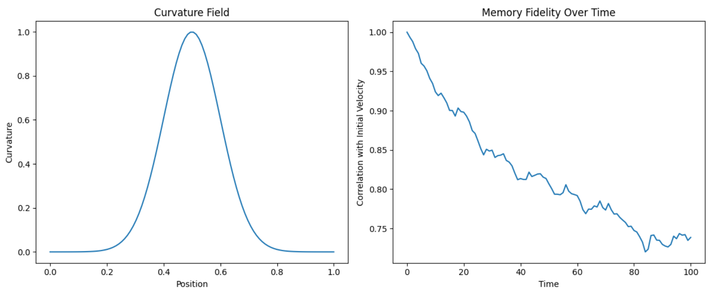

Curvature-Memory Coupling

To explore whether geometry influences reconstructability, we evolved a structured velocity field through a spatial domain with variable curvature. The curvature field, shaped as a Gaussian basin, modulated the strength of stochastic noise—suppressing decoherence in regions of high curvature.

Memory fidelity was tracked over time using correlation with the initial velocity pattern. The results, visualized in the accompanying plots, show that high-curvature zones preserve memory more effectively. Fidelity decayed more slowly where curvature was strongest, suggesting that geometry acts as a stabilizing basin—shielding information from entropy’s diffusion.

These findings support the hypothesis that spacetime curvature is not merely geometric—it plays an active role in modulating entropy and preserving reconstructability. In the HES framework, this coupling between curvature and memory offers a geometric lens on the arrow of time: where space bends, memory lingers.
