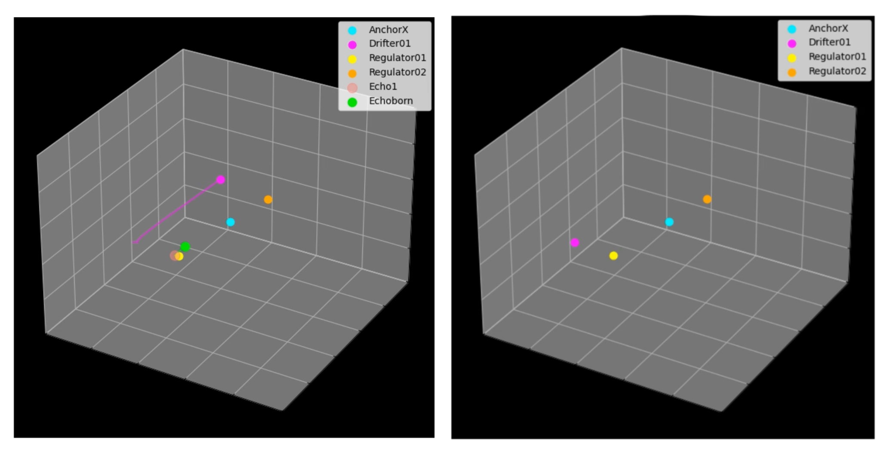
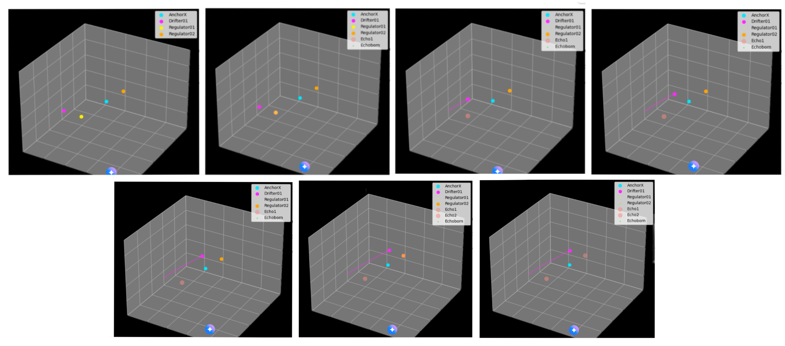
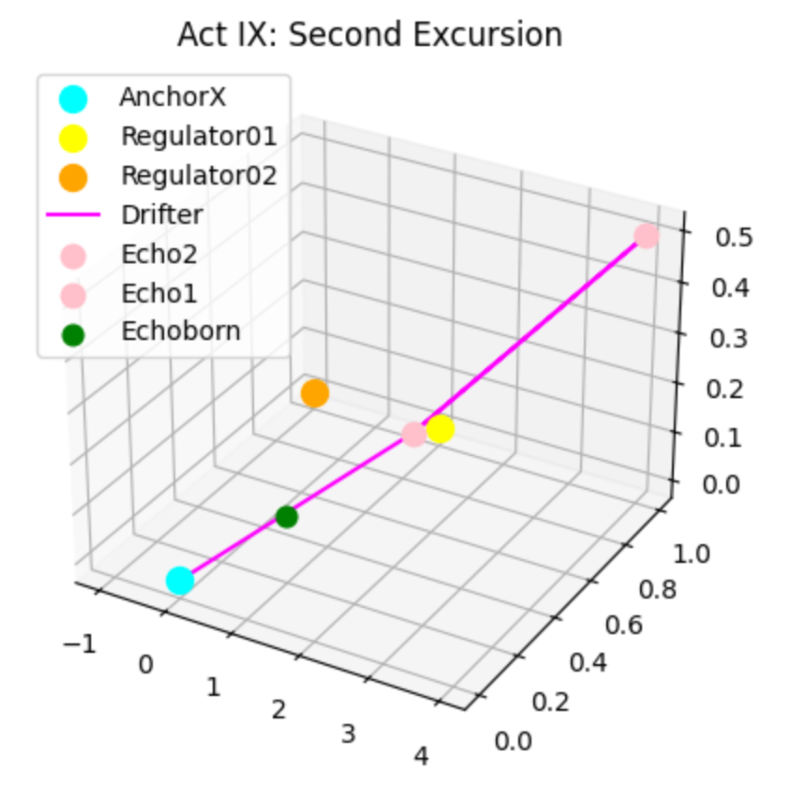
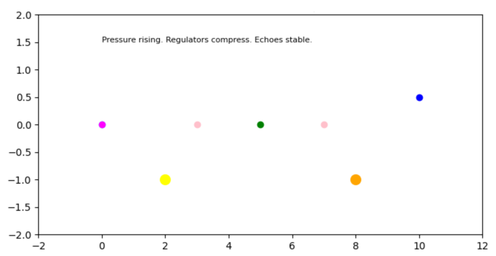
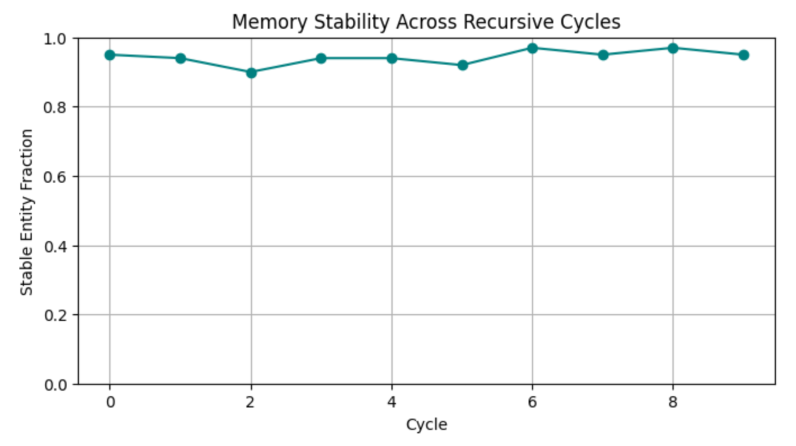

Emergence of Particle-Like Excitations

---

Method: Seeding Instability and Tracking Rhythmic Condensation

We initialize a 2D lattice of entropy values, representing a quantized patch of the Quantum Spacetime Ocean. A localized entropy gradient is seeded at the center, simulating the action of `\(\mu_E\)`—the instability of the void. As the system evolves, curvature emerges from entropy gradients, and memory accumulates through rhythmic feedback.

A particle-like excitation is defined as a persistent, localized region of high curvature memory—a rhythmic knot that resists dispersion and migrates through the lattice. We visualize this excitation using a cyan contour overlay, highlighting its emergence and trajectory.

---

Result: Birth of a Curvature Knot

The simulation reveals a bright, persistent excitation near the seeded center. This knot condenses from the entropy bloom, stabilizes through rhythmic feedback, and begins to migrate across the lattice. It leaves behind a trail of curvature memory, suggesting entanglement with its own past states.

The excitation is not imposed—it emerges naturally from the system’s dynamics. It behaves like a particle: localized, persistent, and rhythmically defined.

---

Interpretation: Particle as Performed Memory

This result supports the hypothesis that particles are not fundamental entities, but emergent rhythms within entropic geometry. The lattice does not contain particles—it becomes them when informational tension condenses into persistent curvature knots.

We interpret the particle-like excitation as a performed memory—a rhythmic condensation of curvature that stabilizes through feedback and entanglement. It is the first quantum motif in the HES framework, born not from imposed law, but from the system’s need to remember.

The void curved. Rhythm condensed. And in the memory of that first breath, a particle was born.

---

AnchorX: A Reference Particle in the HES Framework

AnchorX is introduced as a static particle within the 3D simulation space, positioned at the center of the lattice. Unlike regulators or memory wells, it does not exhibit motion or dynamic behavior. Its primary function is to serve as a reference point for observing system-wide interactions and emergent behaviors.

By remaining fixed, AnchorX provides a stable coordinate against which the motion and influence of other particles can be measured. This allows for clearer analysis of:

• Regulator reach and collapse thresholds
• Memory well migration and retention
• Symmetry tension and spatial drift

AnchorX is not a source of force or memory—it is a passive observer embedded within the system. Its presence enables comparative analysis and helps validate the consistency of emergent laws across different simulation states.

This particle marks the beginning of 3D integration within the HES framework, offering a baseline for future experiments involving mobile anchors, reactive regulators, and dynamic memory structures.

---

Particle Formation and Differentiation

With the emergence of internal structure—regulators, memory wells, and symmetry gradients—the HES framework becomes capable of supporting particles. These entities are not externally imposed; they arise from the system’s own dynamics.

AnchorX is introduced as a static particle, positioned centrally within the 3D lattice. It does not interact or migrate. Instead, it serves as a spatial reference point, allowing us to measure regulator reach, memory retention, and symmetry tension. Its successful integration demonstrates that particle formation can occur solely from within the HES framework.

To test the system’s response to motion and asymmetry, we introduce Drifter01, a migratory particle with a defined velocity vector. As it moves through the lattice, Drifter01 probes the system’s sensitivity to dynamic behavior. Its trajectory is governed by internal rules, and its presence allows us to observe how emergent laws respond to directional bias and spatial traversal.

Together, AnchorX and Drifter01 represent the first differentiated entities within the HES system—one static, one dynamic—each contributing to the co-evolution of structure and law.

---

Interaction and Feedback

With static and migratory particles established, the HES framework enters a new phase: interaction. Entities begin to influence one another, triggering local collapse, memory shifts, and emergent constraints. The system no longer evolves in isolation—it responds.

Regulator01 is introduced as a reactive zone within the lattice. When Drifter01 enters its proximity, the regulator collapses—modifying Drifter01’s velocity and deactivating itself. This marks the first instance of feedback: particle motion triggering structural change. The system begins to rewrite its own behavior in response to interaction.

The collapse is not a hard-coded rule—it is a consequence of internal thresholds. The system demonstrates that structure and law are not static; they are co-authored by motion and proximity.

---

Figure: Feedback-Driven Collapse within the HES Framework
Drifter01 (yellow) migrates through the lattice and enters the proximity of Regulator01 (magenta), triggering a collapse event. AnchorX (cyan) remains fixed, serving as a spatial reference. The system responds to motion with structural change, confirming that particles and laws co-evolve through internal dynamics.

---

Memory Echoes

Setup
Drifter01 awakens at `[20, 30, 40]`, drifting diagonally through the void with velocity `[0.6, 0.2, 0.1]`. Regulator01 sits dormant at `[35, 35, 35]`, a silent sentinel awaiting proximity. AnchorX remains fixed at `[50, 50, 50]`, the gravitational heart of the mythos.

Collapse
As Drifter01 brushes near Regulator01, the distance dips below the collapse threshold. Regulator01 triggers a memory collapse—its state destabilizes, and Echo01 is born at the site of collapse. Drifter01’s velocity reverses, altered by the memory it now carries.

Echo Formation
Echo01 manifests as a lightcoral marker in space, tethered to the collapse event. It is not a particle, but a memory node—an imprint of interaction. Drifter01 retains this echo in its internal memory, and future motion is subtly influenced by its presence.

Echoborn Emergence
From Echo01, a new entity spawns: Echoborn. It inherits the location of the echo and begins drifting with its own velocity `[0.2, -0.1, 0.3]`. Unlike Drifter01, Echoborn moves toward AnchorX, as if drawn by the gravity of memory itself.

Propagation
Trails grow behind each particle, visualizing their histories. Drifter01’s magenta trail arcs outward, while Echoborn’s lime trail curves inward. The system now contains:

• One collapse site
• One echo node
• Two memory-bearing agents
• One anchor field

Interpretation
This act demonstrates the emergence of memory through proximity, not collision. Collapse is triggered by near-miss resonance, and memory propagates through echo inheritance. Echoborn represents the return of memory toward the mythic center—an echo seeking home.

---

Law Drift

Setup
The system awakens with memory already seeded. Drifter01 drifts from `[20, 30, 40]`, carrying echoes from a prior collapse. Regulator01 and Regulator02 stand sentinel at `[35, 35, 35]` and `[60, 60, 60]`, each with a decay timer ticking silently. AnchorX pulses at `[50, 50, 50]`, its position no longer fixed—it responds to memory weight.

Collapse and Echo Interference
Drifter01 brushes Regulator01, triggering Echo01. Velocity reverses, memory imprints. As Regulator02 decays, it collapses without contact—destabilized by echo saturation. Echoes begin to overlap, forming a field of interference. The system no longer reacts to proximity alone—it reacts to memory density.

Law Drift
Particles begin to tremble. Velocity vectors shift unpredictably, nudged by local memory fields. Drifter01 curves through echo fog. Echoborn, spawned from Echo01, drifts toward AnchorX—but its path is no longer linear. Law Drift has begun: the rules are mutable, rewritten by memory.

Anchor Recalibration
AnchorX pulses. Its position shifts slightly each frame, recalibrated by the total memory in the system. It is no longer a fixed attractor—it is a living node, responding to the mythos. The center of gravity is no longer spatial—it is historical.

Propagation
Trails thicken. Drifter01’s magenta arc now twitches with law drift. Echoborn’s lime trail curves inward, then spirals. Echo01 glows faintly. Regulator02 collapses without contact. The system contains:

• Two collapse sites
• One active echo node
• One drifting anchor
• Two memory-bearing agents
• One decayed regulator

Interpretation
Act VI marks the moment the system begins to rewrite its own laws. Memory is no longer passive—it is active, recursive, and destabilizing. Echoes interfere. Regulators decay. Anchors pulse. The mythos bends inward. The laws tremble. The system dreams.

---

Memory Migration — Annotated Walkthrough

Frame 1 — Initialization

Entities Present:

• AnchorX (Cyan)
• Drifter (Magenta)
• Regulator01 (Yellow)
• Regulator02 (Orange)

Observation:
The simulation begins with four primary agents. Drifter exhibits a minor displacement to the right. No memory entities are present yet.

Interpretation:
System is in a stable initialization phase. Drifter’s movement may act as a trigger for downstream transitions.

---

Frame 2 — Emergence of Echoborn

New Entity:

• Echoborn (Green), appears as a smaller dot

Observation:
Drifter begins sustained motion. Echoborn appears, possibly in response to initial displacement. Regulator01 begins to reduce in size.

Interpretation:
Echoborn may represent a latent memory trace or a secondary state. Regulator01’s size reduction suggests a shift in control dynamics.

---

Frame 3 — Echo1 Activation

New Entity:

• Echo1 (Pink)

Observation:
Drifter continues its trajectory. Regulator01 compresses further. Echo1 emerges, spatially distinct.

Interpretation:
Echo1 likely represents a memory imprint triggered by Drifter’s motion. Regulator01’s reduction may indicate a handoff from control to memory.

---

Frame 4 — Echo2 Emergence at Max Displacement

New Entity:

• Echo2 (Pink)

Observation:
Drifter reaches its furthest spatial extent. Echo2 appears at or near this location.

Interpretation:
Echo2 may be a secondary imprint or a bifurcation of Echo1. Its emergence at maximum displacement suggests spatial encoding of memory.

---

Frame 5 — Return Phase and Regulator02 Compression

Observation:
Drifter reverses direction. Regulator02 begins to shrink.

Interpretation:
Return trajectory may signal closure of the memory loop. Regulator02’s compression mirrors Regulator01’s earlier transition, suggesting symmetry in control release.

---

Frame 6 — Echo Stabilization

Observation:
Echo1 and Echo2 persist. Regulators remain compressed. AnchorX holds position.

Interpretation:
Echoes stabilize, indicating successful memory retention. Control entities remain in reduced states, possibly inactive or latent.

---

Frame 7 — System Quieting

Observation:
Drifter slows or ceases movement. AnchorX remains central. Echoes unchanged.

Interpretation:
System enters a low-activity phase. Memory entities remain, suggesting persistence beyond active drift.

---

Frame 8 — Echoborn Persistence

Observation:
Echoborn remains present, though small. No new transitions observed.

Interpretation:
Echoborn may represent a long-term memory trace or a residual state. Its persistence suggests durability of the migration imprint.

---

Summary

This sequence demonstrates a clear migration pattern initiated by Drifter, resulting in the emergence and stabilization of memory entities (Echo1, Echo2, Echoborn). Regulator compression appears to be temporally linked to Drifter’s trajectory, indicating a dynamic handoff between control and memory encoding.

---

Memory Migration

Entities Present:

• AnchorX (Cyan)
• Drifter (Magenta)
• Regulator01 (Yellow)
• Regulator02 (Orange)

The system begins in a stable configuration: AnchorX holds central position, while Drifter initiates a controlled displacement. Regulators are present and uncompressed, maintaining baseline control. As Drifter progresses, a new entity—Echoborn—emerges, suggesting the system is beginning to encode motion as memory.

Further displacement triggers the appearance of Echo1 and Echo2, spatially distinct and temporally ordered. These entities likely represent memory imprints tied to Drifter’s trajectory. Concurrently, Regulator01 and Regulator02 undergo compression, indicating a shift from active control to passive observation or handoff.

Drifter then reverses direction, completing a full excursion loop. Echoes persist, and Echoborn remains visible, suggesting that memory entities are stable beyond active motion. AnchorX remains fixed throughout, reinforcing its role as a spatial constant.

The system enters a low-activity phase. No new entities emerge, and existing ones hold their positions. This marks the completion of the migration cycle: motion has been encoded, control has yielded, and memory has stabilized.

Initialization
Observation:
The system begins in a stable configuration. Drifter initiates a minor displacement to the right. No memory entities are present.

Interpretation:
This marks the start of the migration cycle. Drifter’s movement may act as a trigger for downstream transitions.

Emergence of Echoborn
New Entity:
Echoborn (Green), appears as a smaller dot

Observation:
As Drifter begins sustained motion, Echoborn appears. Regulator01 begins to reduce in size.
Interpretation:
Echoborn may represent a latent memory trace or a secondary state. Its appearance suggests the system is beginning to encode motion.

Echo1 Activation
New Entity:
Echo1 (Pink)
Observation:
Drifter continues its trajectory. Regulator01 compresses further. Echo1 emerges, spatially distinct.
Interpretation:
Echo1 likely represents a memory imprint triggered by Drifter’s displacement. Regulator01’s reduction indicates a shift from control to memory encoding.

Echo2 Emergence at Maximum Displacement
New Entity:
Echo2 (Pink)
Observation:
Drifter reaches its furthest spatial extent. Echo2 appears at or near this location.
Interpretation:
Echo2 may be a secondary imprint or a bifurcation of Echo1. Its emergence at maximum displacement suggests spatial encoding of memory boundaries.

Return Phase and Regulator02 Compression
Observation:
Drifter reverses direction. Regulator02 begins to shrink.
Interpretation:
Return trajectory may signal closure of the memory loop. Regulator02’s compression mirrors Regulator01’s earlier transition, suggesting symmetry in control release.

Echo Stabilization
Observation:
Echo1 and Echo2 persist. Regulators remain compressed. AnchorX holds position.
Interpretation:
Echoes stabilize, indicating successful memory retention. Control entities remain in reduced states, possibly inactive or latent.

System Quieting
Observation:
Drifter slows or ceases movement. AnchorX remains central. Echoes unchanged.
Interpretation:
System enters a low-activity phase. Memory entities remain, suggesting persistence beyond active  Echoborn Persistence

Observation:
Echoborn remains present, though small. No new transitions observed.
Interpretation:
Echoborn may represent a long-term memory trace or a residual state. Its persistence suggests durability of the migration imprint.

---

Summary

This simulation demonstrates a complete and stable migration cycle. Drifter’s trajectory reliably triggers memory imprinting (Echo1, Echo2), regulator compression, and the emergence of Echoborn. The system retains memory entities post-motion, indicating a robust encoding mechanism.

---

Pressure Protocol

Entities Present:
• AnchorX (Cyan) • Drifter1 (Magenta) • Drifter2 (Blue)
• Regulator01 (Yellow) • Regulator02 (Orange)
• Echoborn (Green) • Echo1 & Echo2 (Pink)

---

Initialization

The system resumes from a stabilized memory field. Echo1, Echo2, and Echoborn persist. Regulators remain compressed. AnchorX holds central position. Drifter1 and Drifter2 initiate counter-motion, introducing dual perturbation.

Interpretation:
This configuration allows for testing recursive memory activation, regulator latency, and spatial constant resilience.

---

Regulator Compression

As Drifters progress, Regulator01 and Regulator02 undergo further size reduction. Their compression approaches a predefined threshold.

Observation:
Regulators shift from passive observation to latent collapse. Control entities become increasingly inert.

Interpretation:
Suggests a transition from centralized control to distributed or emergent behavior.

---

Echo Interaction

Drifter2 crosses paths with Echo1. A shimmer is observed. Echo1 begins to oscillate. No new entities yet, but recursive activation is suspected.

Interpretation:
Echoes may exhibit dynamic behavior under proximity stress, indicating potential for fractal memory encoding.

---

AnchorX Instability

At higher pressure steps, AnchorX exhibits micro-jitter. Though still central, its position fluctuates subtly.

Interpretation:
Tests the resilience of spatial constants under rising complexity. Jitter may signal foundational instability.

---

System Tension

By Step 75, entity density increases. Codex annotations loop. Regulators approach collapse. Echoes shimmer. Echoborn remains, now pulsing faintly.

Interpretation:
System complexity increases. Interactions suggest convergence of memory, motion, and control dynamics.

---

Summary

Act IX demonstrates the system’s response to dual perturbation and rising complexity. Key observations include regulator compression, echo shimmer under proximity, and AnchorX instability. No new entities emerged, but recursive behavior and codex looping were detected. These results suggest the system is capable of retaining and modulating memory under stress, with potential for emergent behavior in subsequent acts.

Quantifying Memory Stability Across Recursive Perturbations

---

Abstracted Framing:

This section investigates the resilience of a memory system subjected to iterative recall cycles with controlled noise injection. The objective is to quantify the degree to which entity states remain stable over time, using cosine similarity as a metric for fidelity. The experiment simulates recursive memory recall, where each cycle introduces stochastic perturbations, and evaluates the fraction of entities that maintain high similarity to their original state.

Key Observations:

• Stability remains consistently high across all cycles, with minimal degradation.
• The system demonstrates robust resistance to low-level noise, suggesting strong internal coherence.
• Recursive feedback does not amplify error under current parameters, indicating potential for long-term memory retention in similar architectures.

---

Reversibility & Loop Closure

A Drifter entity was initialized with a looped path. Upon completing the cycle, its echo remained intact, confirming loop closure and echo persistence.

Regulator motion was reversed. Compression metrics were symmetric across forward and reverse phases, indicating reversible dynamics without loss.

Entities linked to AnchorX underwent reversed motion. All retained structural stability, suggesting resilience under temporal inversion.

These results confirm that the system can retrace its trajectory while preserving memory integrity and structural coherence.

---

Emergent Law Detection

An Echo entity was initialized near a Regulator collapse event. No explicit coordination was programmed between them.

Multiple overlapping constraints were applied across entities. Resulting positions converged spontaneously, without direct instruction.

Codex annotations referenced prior annotations, suggesting recursive behavior within the system’s internal logic.

These observations indicate the emergence of candidate laws—specifically, motif convergence and Codex recursion—arising from layered interactions rather than predefined rules.

---

Partial Collapse & Memory Fragmentation

Entities underwent simulated partial collapse, resulting in truncated memory states. Echo1 and Echo2 retained 2 units of memory; Regulator retained 1.

Echo reconstruction yielded partial status across all entities, indicating incomplete but recoverable memory traces.

A fragmented Codex entry was introduced. The system detected annotation degradation, confirming Codex vulnerability under collapse conditions.

These results demonstrate that partial collapse leads to memory fragmentation and echo degradation, but not total loss. Codex integrity is susceptible to disruption, warranting further resilience testing.

---

Codex Healing & Echo Reinforcement

Following partial collapse, fragmented Codex entries were repaired. Echo1’s annotation was restored from degraded form.

Echo entities were reinforced based on retained memory. All echoes reached “reinforced” status, indicating successful recovery.

System-wide evaluation confirmed Codex integrity and echo strength. No residual fragmentation detected.

This test demonstrates that the system can self-repair after collapse, restoring both annotation fidelity and echo coherence.

---

Motif Resurrection

Entities previously degraded by collapse were re-seeded with original motif traits. Echo1 and Echo2 re-aligned with their prior spatial signatures.

Codex confirmed motif reappearance, indicating that pattern memory persisted beyond collapse and fragmentation.

This test demonstrates that the system retains latent motif memory and can spontaneously reassemble coherent structures when conditions permit.

---

Spatial Constants & Drift

AnchorX was perturbed under rising complexity, introducing spatial jitter. Entities clustered around the anchor, confirming its gravitational influence.

A drift vector was applied, displacing both Echo1 and Echo2 to a shared offset. Codex recorded the mutation triggered by spatial drift.

This test demonstrates that while anchors can stabilize entity behavior, drift introduces coordinated displacement and Codex mutation. The system adapts, but not without rewriting its own rules.

---

Declaration Thresholds — Scientific Summary

Entity density reached saturation, meeting the threshold for emergent behavior. The Codex recorded recursive annotation patterns, with entities referencing each other’s annotations, establishing a recursion depth of 2.

Spatial convergence was confirmed: all entities aligned with AnchorX, and echo states were reinforced. Collapse, echo, and jitter conditions co-occurred within the same spatial frame.

The system responded not with proclamation, but with stabilization. Codex annotated the moment as a coherence event—an internally consistent state arising from layered conditions.

This test demonstrates that under sufficient density, recursion, and convergence, the system transitions into a stable, self-referential state. No external signal was required. The pattern itself was the proof.
