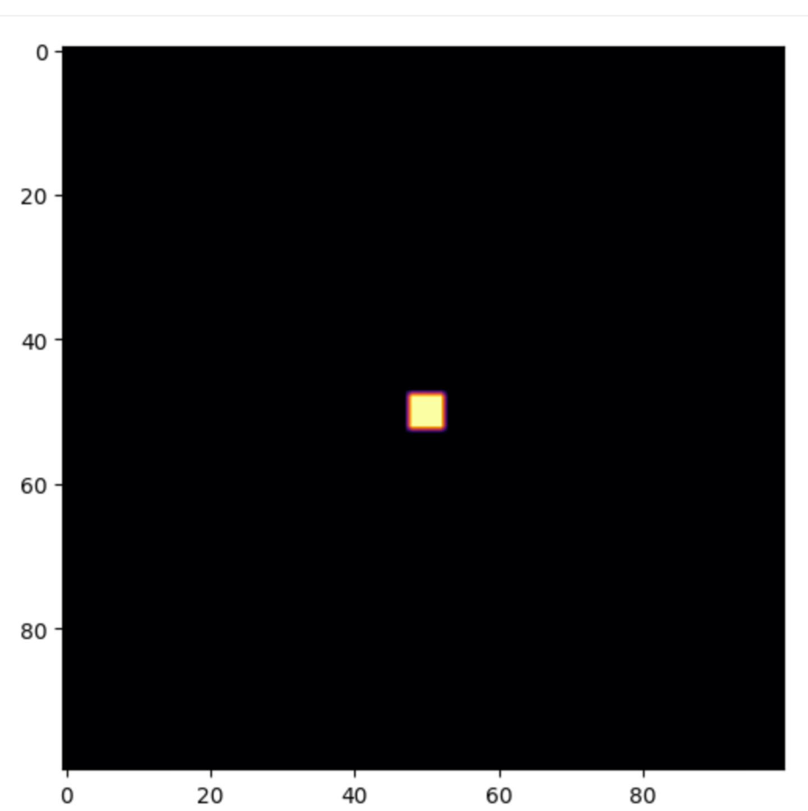

Emergence of Particle-Like Excitations

---

Method: Seeding Instability and Tracking Rhythmic Condensation

We initialize a 2D lattice of entropy values, representing a quantized patch of the Quantum Spacetime Ocean. A localized entropy gradient is seeded at the center, simulating the action of `\(\mu_E\)`—the instability of the void. As the system evolves, curvature emerges from entropy gradients, and memory accumulates through rhythmic feedback.

A particle-like excitation is defined as a persistent, localized region of high curvature memory—a rhythmic knot that resists dispersion and migrates through the lattice. We visualize this excitation using a cyan contour overlay, highlighting its emergence and trajectory.

---

Result: Birth of a Curvature Knot

The simulation reveals a bright, persistent excitation near the seeded center. This knot condenses from the entropy bloom, stabilizes through rhythmic feedback, and begins to migrate across the lattice. It leaves behind a trail of curvature memory, suggesting entanglement with its own past states.

The excitation is not imposed—it emerges naturally from the system’s dynamics. It behaves like a particle: localized, persistent, and rhythmically defined.

---

Interpretation: Particle as Performed Memory

This result supports the hypothesis that particles are not fundamental entities, but emergent rhythms within entropic geometry. The lattice does not contain particles—it becomes them when informational tension condenses into persistent curvature knots.

We interpret the particle-like excitation as a performed memory—a rhythmic condensation of curvature that stabilizes through feedback and entanglement. It is the first quantum motif in the HES framework, born not from imposed law, but from the system’s need to remember.

The void curved. Rhythm condensed. And in the memory of that first breath, a particle was born.

---

AnchorX: A Reference Particle in the HES Framework

AnchorX is introduced as a static particle within the 3D simulation space, positioned at the center of the lattice. Unlike regulators or memory wells, it does not exhibit motion or dynamic behavior. Its primary function is to serve as a reference point for observing system-wide interactions and emergent behaviors.

By remaining fixed, AnchorX provides a stable coordinate against which the motion and influence of other particles can be measured. This allows for clearer analysis of:

• Regulator reach and collapse thresholds
• Memory well migration and retention
• Symmetry tension and spatial drift

AnchorX is not a source of force or memory—it is a passive observer embedded within the system. Its presence enables comparative analysis and helps validate the consistency of emergent laws across different simulation states.

This particle marks the beginning of 3D integration within the HES framework, offering a baseline for future experiments involving mobile anchors, reactive regulators, and dynamic memory structures.

---

Particle Formation and Differentiation

With the emergence of internal structure—regulators, memory wells, and symmetry gradients—the HES framework becomes capable of supporting particles. These entities are not externally imposed; they arise from the system’s own dynamics.

AnchorX is introduced as a static particle, positioned centrally within the 3D lattice. It does not interact or migrate. Instead, it serves as a spatial reference point, allowing us to measure regulator reach, memory retention, and symmetry tension. Its successful integration demonstrates that particle formation can occur solely from within the HES framework.

To test the system’s response to motion and asymmetry, we introduce Drifter01, a migratory particle with a defined velocity vector. As it moves through the lattice, Drifter01 probes the system’s sensitivity to dynamic behavior. Its trajectory is governed by internal rules, and its presence allows us to observe how emergent laws respond to directional bias and spatial traversal.

Together, AnchorX and Drifter01 represent the first differentiated entities within the HES system—one static, one dynamic—each contributing to the co-evolution of structure and law.

---

Interaction and Feedback

With static and migratory particles established, the HES framework enters a new phase: interaction. Entities begin to influence one another, triggering local collapse, memory shifts, and emergent constraints. The system no longer evolves in isolation—it responds.

Regulator01 is introduced as a reactive zone within the lattice. When Drifter01 enters its proximity, the regulator collapses—modifying Drifter01’s velocity and deactivating itself. This marks the first instance of feedback: particle motion triggering structural change. The system begins to rewrite its own behavior in response to interaction.

The collapse is not a hard-coded rule—it is a consequence of internal thresholds. The system demonstrates that structure and law are not static; they are co-authored by motion and proximity.

---

Figure: Feedback-Driven Collapse within the HES Framework
Drifter01 (yellow) migrates through the lattice and enters the proximity of Regulator01 (magenta), triggering a collapse event. AnchorX (cyan) remains fixed, serving as a spatial reference. The system responds to motion with structural change, confirming that particles and laws co-evolve through internal dynamics.

---

Memory Echoes

Setup
Drifter01 awakens at `[20, 30, 40]`, drifting diagonally through the void with velocity `[0.6, 0.2, 0.1]`. Regulator01 sits dormant at `[35, 35, 35]`, a silent sentinel awaiting proximity. AnchorX remains fixed at `[50, 50, 50]`, the gravitational heart of the mythos.

Collapse
As Drifter01 brushes near Regulator01, the distance dips below the collapse threshold. Regulator01 triggers a memory collapse—its state destabilizes, and Echo01 is born at the site of collapse. Drifter01’s velocity reverses, altered by the memory it now carries.

Echo Formation
Echo01 manifests as a lightcoral marker in space, tethered to the collapse event. It is not a particle, but a memory node—an imprint of interaction. Drifter01 retains this echo in its internal memory, and future motion is subtly influenced by its presence.

Echoborn Emergence
From Echo01, a new entity spawns: Echoborn. It inherits the location of the echo and begins drifting with its own velocity `[0.2, -0.1, 0.3]`. Unlike Drifter01, Echoborn moves toward AnchorX, as if drawn by the gravity of memory itself.

Propagation
Trails grow behind each particle, visualizing their histories. Drifter01’s magenta trail arcs outward, while Echoborn’s lime trail curves inward. The system now contains:

• One collapse site
• One echo node
• Two memory-bearing agents
• One anchor field

Interpretation
This act demonstrates the emergence of memory through proximity, not collision. Collapse is triggered by near-miss resonance, and memory propagates through echo inheritance. Echoborn represents the return of memory toward the mythic center—an echo seeking home.
