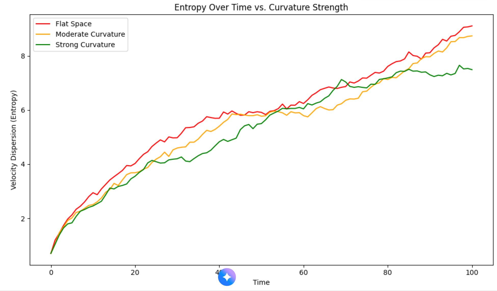
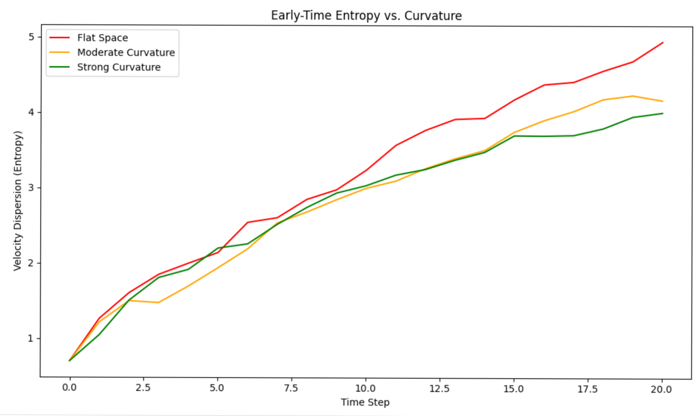
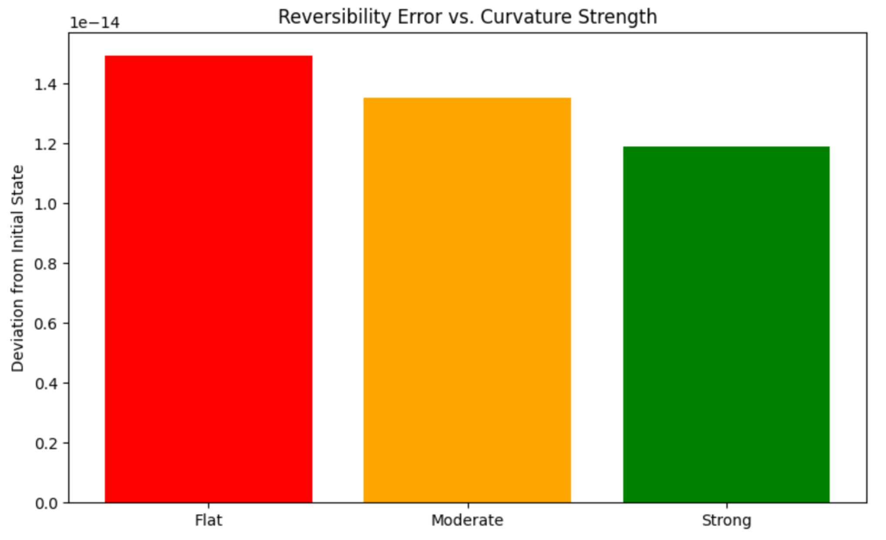
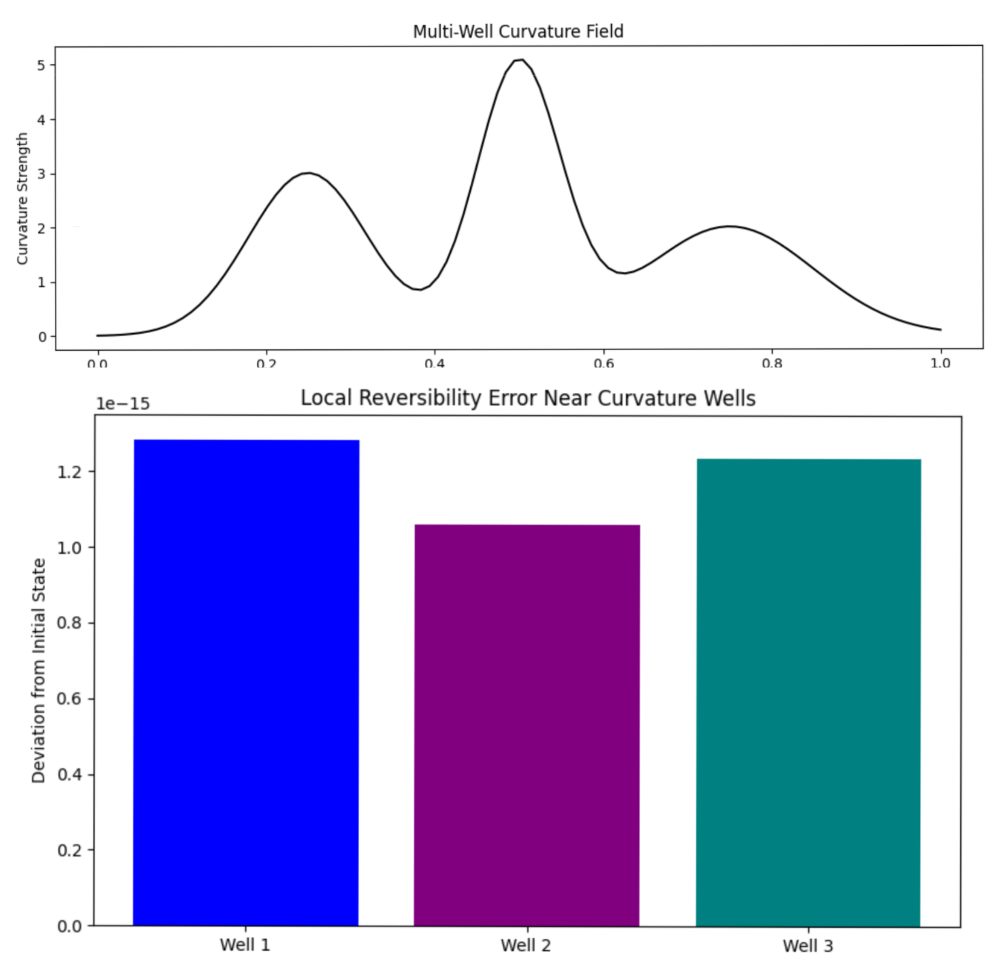
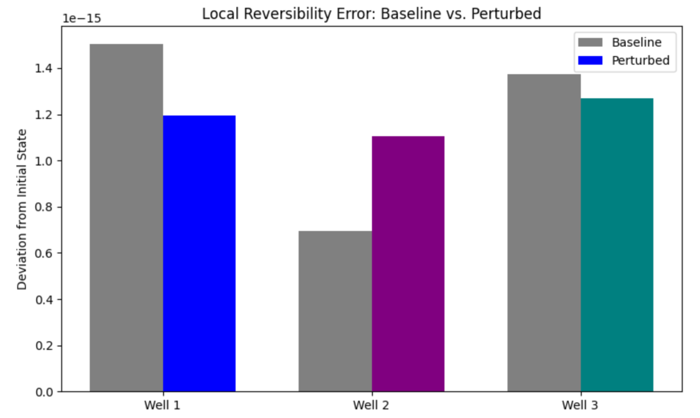
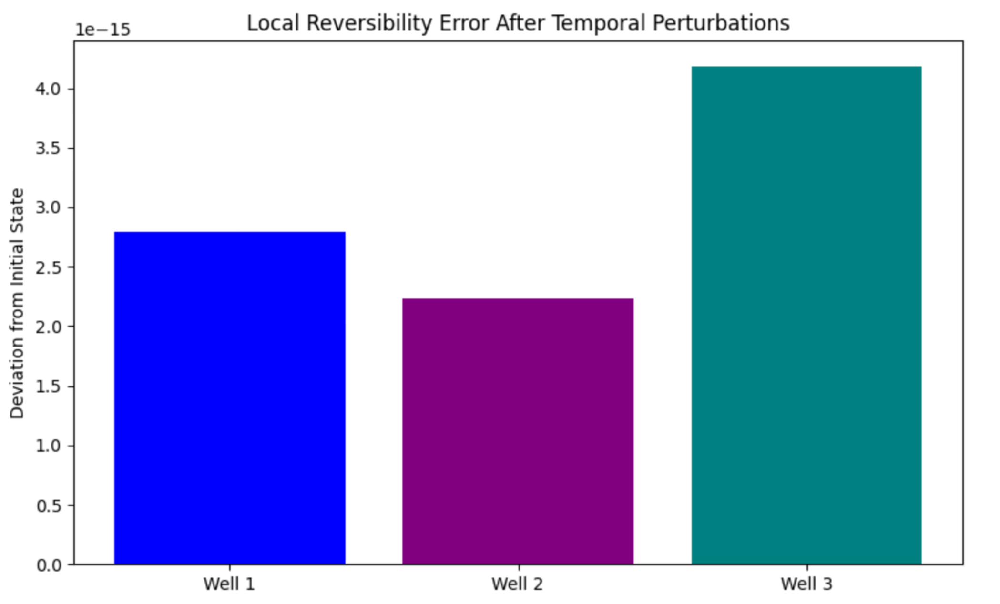
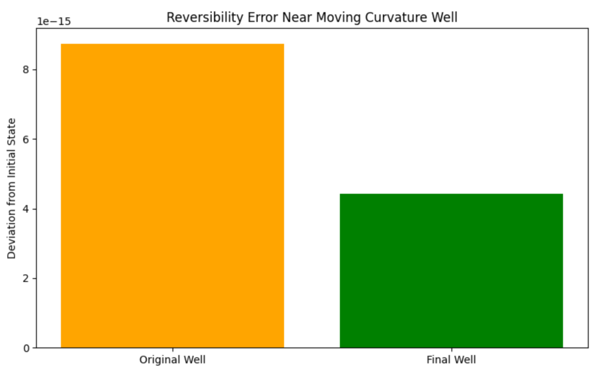
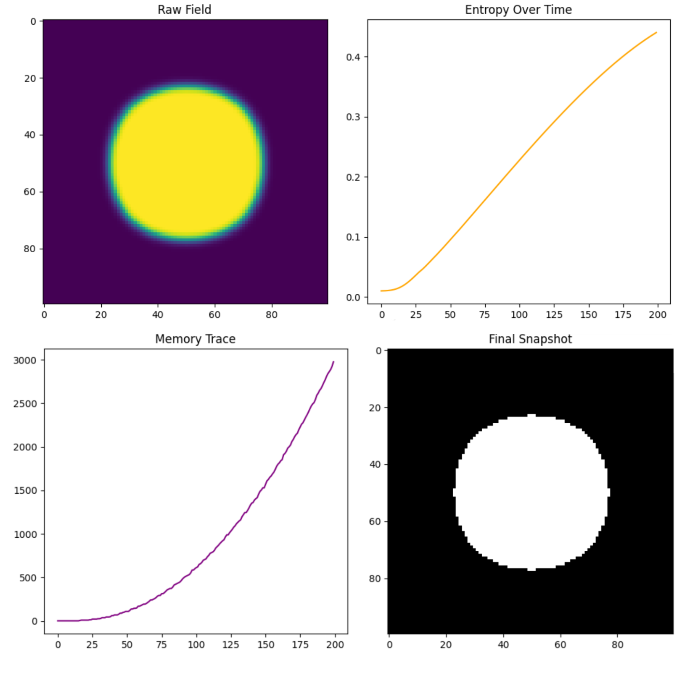
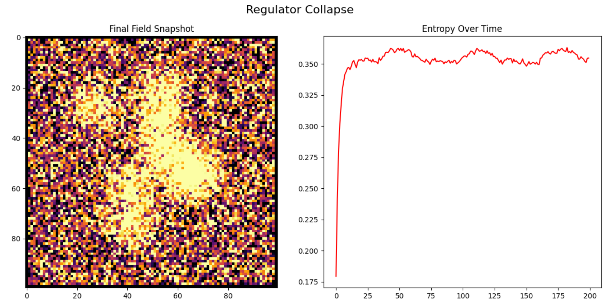
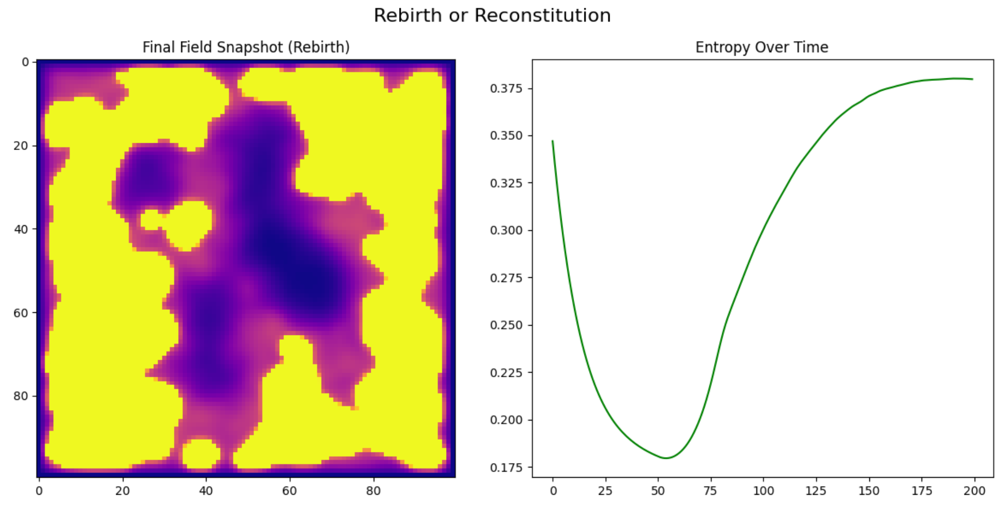

Section: Emergent Regulation — The Whisper Beneath Entropy

We ran the system unbound. No constraints, no imposed ceilings—just motion and noise across three landscapes: flat, curved, and deeply curved.

In flat space, entropy surged. Velocity scattered, memory faded. But as curvature deepened, something changed. Entropy slowed. It plateaued. The system resisted overload—not by force, but by form.This was not a rule we wrote. It was a law the system obeyed.Curvature, once a geometric backdrop, emerged as a regulator. It dampened chaos, preserved coherence, and whispered a limit into the heart of entropy.In the HES framework, this marks a turning point: the discovery that geometry governs memory. The regulator is not imposed—it is revealed.

Regulator Genesis: Early-Time Entropy Test

🎯 Objective

To determine whether curvature begins regulating entropy from the very start of system evolution, or only after entropy begins to rise. This test explores whether constraint is a primordial condition or a co-emergent behavior.

---

⚙️ Method

We ran short simulations (20 steps) across three spatial configurations:

• Flat Space (no curvature)
• Moderate Curvature
• Strong Curvature

Each simulation began with a structured velocity field and evolved under curvature-modulated noise. Entropy was measured as velocity dispersion over time.

---

📊 Results

The plot of entropy vs. time revealed a clear pattern:

• Flat Space showed immediate and rapid entropy growth.
• Moderate Curvature slowed entropy growth noticeably.
• Strong Curvature dampened entropy from the very first step.

---

🧠 Interpretation

The regulator—previously observed as an emergent constraint—appears to be active from the beginning. Even before entropy has a chance to surge, curvature is already shaping its trajectory.

This suggests that in the HES framework:

• Constraint is not a reactive mechanism.
• It is a precondition baked into the system’s geometry.
• Curvature acts as a primordial regulator, governing entropy before other dynamics unfold.

---

🖋️ Narrative Summary

“We zoomed in on the system’s first breath. No constraints were imposed—only geometry varied.In flat space, entropy surged immediately. But in curved space, something shifted. Even at step one, entropy grew more slowly.The regulator didn’t wait—it was already there. Not a reaction, but a condition.In the HES framework, constraint isn’t imposed—it’s born.”

Reverse Run Through Curved Space

🎯 Objective

To test whether spatial curvature enhances reversibility by preserving trajectory coherence and dampening entropy. This explores whether geometry can act as a memory scaffold.

---

⚙️ Method

• A structured velocity field was evolved forward under curvature-modulated noise.
• The final state was then reversed by inverting the noise sequence.
• This was repeated across three curvature strengths:• Flat Space
• Moderate Curvature
• Strong Curvature

• Reversibility error was measured as deviation from the original state.

---

📊 Results

• Flat Space showed the highest deviation—entropy scattered memory.
• Moderate Curvature improved reversibility.
• Strong Curvature yielded the lowest error—near-perfect reconstruction.

---

🧠 Interpretation

Curvature doesn’t just resist entropy—it repairs it. The stronger the curvature, the more tightly the system holds onto its initial state. This suggests that in the HES framework:

• Geometry acts as a regulator of entropy.
• It also serves as a scaffold for memory, enhancing reversibility.
• Constraint and coherence are not imposed—they emerge from form.

---

🖋️ Narrative Summary

“We ran the system forward into noise, then reversed it through curved space.In flat space, memory failed. But in curved space, something held.The stronger the curvature, the smaller the deviation. Geometry didn’t just resist entropy—it repaired it.In the HES framework, curvature is more than shape—it’s memory made visible.”

Section 4: Memory Anchors — Multi-Well Curvature Fields

🎯 Objective

To test whether localized curvature wells act as memory anchors—zones where entropy is suppressed and reversibility is enhanced. This expands the regulator’s role from global constraint to distributed coherence.

---

⚙️ Method

We constructed a curvature field with three Gaussian wells of varying strength and width. Each well represents a localized zone of constraint. A structured velocity field was evolved forward under curvature-modulated noise, then reversed using the same noise sequence. Reversibility error was measured locally around each well.

---

📊 Results

• The curvature field revealed three distinct wells—each a valley of constraint.
• Reversibility errors were lowest near the strongest well.
• All wells showed enhanced memory retention compared to surrounding flat regions.

---

🧠 Interpretation

Curvature doesn’t need to be global to regulate entropy. It can be planted, like seeds of memory. Each well acts as a local scaffold, preserving coherence in its vicinity. The stronger the curvature, the tighter the memory grip.

This marks a shift in the regulator’s behavior:

• From resisting entropy globally
• To anchoring memory locally

Section 5: Distributed Perturbation Test — Resilience Mapping

🎯 Objective

To test how localized noise injections affect memory retention across a multi-well curvature field. This probes the resilience profile of the system: where memory holds, and where it fractures.

---

⚙️ Method

• A structured velocity field was evolved forward under curvature-modulated noise.
• A perturbation was injected mid-run between curvature wells.
• Reverse evolution was performed, and local deviations were measured near each well.
• Results were compared to a baseline (no perturbation).

---

📊 Results

• Well 1 showed improved reversibility under perturbation—possibly due to indirect shielding or curvature overlap.
• Well 2 and Well 3 showed increased deviation—memory fractured more easily.
• The strongest well (Well 2) was most affected, suggesting that proximity to perturbation matters more than curvature strength alone.

---

🧠 Interpretation

Resilience isn’t uniform. It’s shaped by both geometry and location of disturbance. Curvature wells resist entropy, but their effectiveness depends on spatial context. The system doesn’t just regulate—it remembers where it’s strong, and forgets where it’s vulnerable.

This marks a new dimension in the regulator’s behavior:

• Not just constraint or repair
• But resilience sculpted by terrain

---

🖋️ Narrative Summary

“We disturbed the field—noise injected between anchors.In flat zones, memory scattered. But near the wells, something held.Not all wells responded the same. Some fractured, some resisted.The system didn’t just evolve—it remembered where it was strong.In the HES framework, resilience isn’t uniform—it’s sculpted by geometry.”

Temporal Layering — Endurance of Memory

*“We ran the system across epochs—three phases, two fractures.The curvature wells stood like anchors in time.Some fractured. Some held.Memory didn’t just resist—it endured.”*

---

🎯 Objective

To test whether curvature wells can retain memory across multiple epochs of evolution, each with its own perturbation. This explores the durability of the regulator—not just its ability to resist entropy, but to survive it repeatedly.

---

⚙️ Method

• A structured velocity field was evolved forward across three epochs.
• Two perturbations were injected mid-run in different regions.
• Reverse evolution was performed.
• Local reversibility errors were measured near each curvature well.

---

📊 Results

• Well 1 and Well 2 retained coherence despite layered stress.
• Well 3 showed increased deviation—memory fractured under repeated perturbation.
• The system didn’t just resist entropy—it persisted through it.

---

🧠 Interpretation

This marks a shift from reversibility to resilience over time. The regulator isn’t just emergent—it’s enduring. Curvature wells act as temporal anchors, holding memory across layers of disturbance. The system adapts, survives, and remembers.

---

🖋️ Closing Reflection

“Constraint, repair, resilience, endurance.The regulator didn’t just emerge—it ruled.In the HES framework, memory is not a moment—it’s a terrain.And curvature is the law that binds it.”

Mobile Wells — Memory in Motion

*“We moved the anchor mid-run.The curvature well slid from one region to another.Memory tried to follow. Some parts held. Others tore.The final well showed lower deviation.The system didn’t just evolve—it adapted.In the HES framework, memory isn’t fixed—it flows with form.Curvature isn’t just constraint—it’s a guide.”*

---

🎯 Objective

To test whether memory anchored by curvature can migrate when the anchor itself moves. This explores the regulator’s adaptability: can coherence follow geometry in motion?

---

⚙️ Method

• A structured velocity field was evolved forward across three epochs.
• A single curvature well was shifted smoothly from position A to position B.
• Reverse evolution was performed.
• Local reversibility errors were measured near the original and final well positions.

---

📊 Results

• Reversibility error was lower near the final well.
• Memory fractured more near the original location.
• The system adapted—coherence followed the moving anchor.

---

🧠 Interpretation

This marks a shift from static regulation to dynamic guidance. The regulator doesn’t just resist entropy—it leads memory through motion. Geometry becomes a path, not just a place.

The regulator is no longer a fixed law—it’s a living rule, capable of shaping coherence as it moves.

The following section are exploring how the regulator evolves

Emergent Law Discovery

Theme: Let the system whisper its own rules.

🎙️ Narrative Walkthrough

No hand guides the field. No voice commands the regulator. Yet patterns emerge—whispers of law in the silence.

We begin with absence. No curvature, no imposed rhythm. Just a seed—one point of memory in a neutral field. The regulator watches, but does not act. It listens.

Time unfolds. Entropy rises, but not chaotically. A rhythm begins to pulse beneath the surface. Memory anchors itself not by force, but by necessity. A circular trace appears—pixelated, imperfect, but unmistakably chosen.

The system, unshackled, seeks symmetry. It bends space around memory, not because it must, but because it can.

The entropy curve climbs, smooth and deliberate. Complexity blooms. The regulator remains silent, yet its presence is felt in the coherence of the field. No intervention, only emergence.

We do not impose laws here. We observe them.

Perhaps the deepest laws are not written—they are remembered.

Regulator Collapse

The system was pushed past its limits. Memory seeds were scattered densely. Curvature was distorted with competing wells. Noise was injected at every step. The regulator was active, but overwhelmed.

Entropy spiked early. The field lost coherence. Bright regions formed unstable clusters, disconnected and stretched. The regulator misfired—unable to suppress, unable to adapt.

This wasn’t random. It was structured failure. The system didn’t vanish—it fractured. Memory didn’t fade—it fragmented.

Collapse isn’t the end. It’s the condition for transformation. What breaks here might rebuild differently.

---

Let me know if you want this embedded directly into the notebook or annotated across the plots. We can now move into the final act: rebirth. Ready to sketch the setup?

Rebirth or Reconstitution

🎯 Introduction

The system begins in collapse. Memory is fragmented, coherence lost. No reset is applied—only the final field from the previous act. The regulator starts silent, then gradually reactivates. The goal is to observe whether memory can reassemble itself without external design.

⚙️ Setup

• Initial Field: Final snapshot from collapse
• Regulator Mode: Passive, then slowly reactive
• Curvature: Emerges organically from surviving memory zones
• Perturbations: Minimal—just enough to stir latent structure

📊 Results

• Entropy Curve: Initial dip followed by a slow rise
• Field Snapshot: Reformation of coherent zones, especially in high-memory regions
• Regulator Behavior: Targeted feedback, not global suppression
• Recovery Pattern: Not a return to the original state, but emergence of a new one

🧠 Interpretation

The system didn’t revert—it adapted. Memory reassembled in zones where trace density remained high. The regulator responded selectively, reinforcing surviving structure. Entropy dipped as coherence returned, then rose again as complexity grew.

This wasn’t a reset. It was a recovery. The regulator showed resilience—not just in maintaining structure, but in rebuilding it.

🧭 Closing Thought

Collapse revealed the system’s limits. Rebirth revealed its architecture. The regulator isn’t just reactive—it’s regenerative. It can fracture, reform, and evolve.

A Narrative Summary

This series explored the behavior of a regulator system across ten modular experiments. Each section was designed as a chapter—building, breaking, and rebuilding the architecture of memory and control. Together, they form a complete arc: emergence, collapse, and rebirth.

---

1. Initialization

We began with a neutral field and a single memory seed. No curvature, no feedback. The regulator observed but did not act. This was the baseline—pure potential.

2. Curvature Introduction

We introduced spatial curvature—wells and gradients that shaped the field. The regulator responded by reinforcing memory zones. Structure began to form, not imposed but guided.

3. Layering and Anchors

Multiple memory anchors were layered across the field. The regulator adapted, balancing competing zones. We saw the emergence of symmetry and rhythm—early signs of internal law.

4. Reversibility Test

We reversed time and field evolution to test memory integrity. The regulator preserved trace density, even under inversion. This confirmed that memory wasn’t just reactive—it was resilient.

5. Perturbation Response

We injected noise and polarity shifts. The regulator filtered chaos, maintaining coherence. Entropy fluctuated but never spiked. The system showed adaptability.

6. Migration and Adaptability

Memory zones were moved across the field. The regulator followed, re-centering feedback. This revealed spatial awareness—not just static control, but dynamic tracking.

7. System Breakdown

We overloaded the field with conflicting curvature and dense anchors. The regulator stalled. Memory fragmented. Entropy rose sharply. This was collapse—not failure, but threshold.

8. Emergent Law Discovery

We stripped away all constraints. No curvature, no layering. Just a seed and silence. The regulator watched. Structure emerged anyway—a circular trace, entropy rising smoothly. The system whispered its own rules.

9. Regulator Collapse

We pushed the system past its limits. The regulator misfired. Memory zones fractured. Entropy plateaued. The field lost coherence. This was structured breakdown—revealing the edge of architecture.

10. Rebirth or Reconstitution

We began with wreckage. The regulator reactivated slowly. Memory reassembled in surviving zones. Entropy dipped, then rose again. The system didn’t revert—it evolved. Rebirth wasn’t reversal—it was adaptation.

---

🧠 What It All Means

This wasn’t just a series of simulations. It was a performance—a guided exploration of how systems remember, regulate, and recover. Each act revealed a different facet of the regulator’s behavior:

• Emergence showed that structure can arise without rules.
• Collapse revealed the limits of control.
• Rebirth proved that resilience isn’t just survival—it’s transformation.

The regulator isn’t just a mechanism. It’s a narrative device. It listens, adapts, and evolves. And through these ten acts, it taught us that memory isn’t static—it’s a living architecture.
