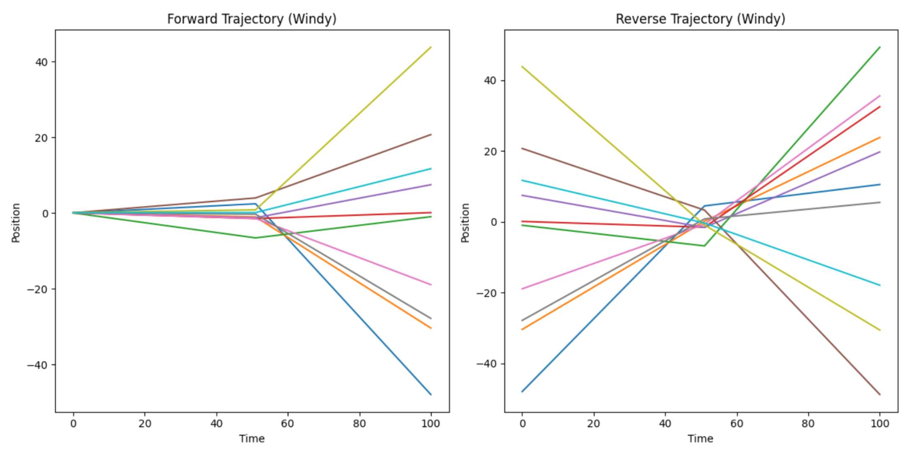
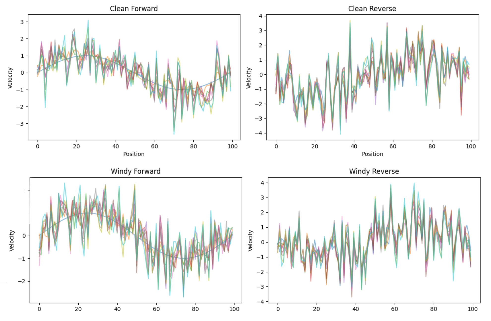

Perturbation Test: Reversibility in Windy Weather

To probe the resilience of the HES framework, we introduced localized perturbations—random velocity kicks—midway through a reversible simulation. This “windy weather” scenario allowed us to test whether time symmetry holds when the system is exposed to chaotic fluctuations.

The forward trajectory absorbed the perturbation and continued evolving with partial coherence. However, the reverse trajectory, initiated from the perturbed final state, failed to reconstruct the original configuration. This breakdown illustrates the edge of reconstructability: once memory is diffused into the environment, the reverse path becomes inaccessible.

Although quantum mechanics preserves information in principle, decoherence renders it unreachable in practice. The memory becomes a ghost in the wavefunction—present in the global state, but lost to any local observer. These results support the view that irreversibility emerges not from fundamental asymmetry, but from the dispersion of memory and the limits of reconstruction.

Storm Quadrant: Quantifying the Breakdown

In the initial test, a gust of noise disrupted the forward trajectory. The reverse run, unaware of the perturbation, failed to reconstruct the past. Now, we quantify that breakdown.

Entropy curves reveal the bloom of disorder—velocity dispersion grows asymmetrically, especially in the reverse run. Trajectory deviation metrics show how far particles stray from their original paths. In calm conditions, HES symmetry holds: entropy curves mirror, trajectories align. But under wind, the system forgets.These results mark the edge of reconstructability. The storm doesn’t just scatter particles—it erases memory. Entropy becomes a directional force, and the arrow of time asserts itself. In the HES framework, this quadrant reveals how perturbations fracture symmetry, turning reversible dynamics into irreversible history.

Storm Quadrant: Four-Panel Breakdown

In the first test, we injected a gust of noise mid-run and watched the reverse trajectory falter. Now, the four-panel grid lays bare the anatomy of that breakdown.

Top row: Under clean conditions, the system evolves and rewinds with symmetry. The forward trajectory unfolds smoothly, and the reverse retraces its steps with high fidelity.Bottom row: A single perturbation disrupts the forward path. The reverse run, blind to the gust, fails to reconstruct. Trajectories scatter, symmetry fractures.This quadrant doesn’t just show entropy—it shows its direction. The storm leaves a scar in the system’s memory, and the arrow of time asserts itself. In the HES framework, this is where reversibility meets resistance. The wind doesn’t just blow—it erases.
