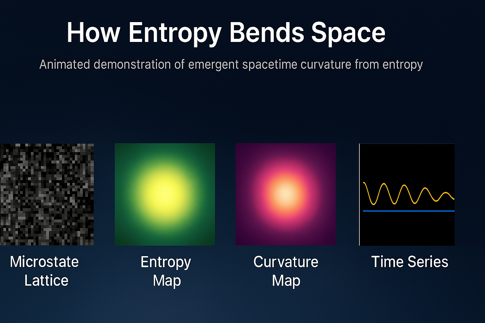

White Paper draught.
https://drive.google.com/file/d/1Scq7Xdx_0wDSIzNmuNG6lQ6R6yVffMVO/view?usp=drivesdk

images of simulation results
https://drive.google.com/drive/folders/1HkVEK11KoTjtAGBJjKgb057FeaVZARVy

# HES-benchmark
Simulation of emergent spacetime curvature from entanglement entropy using the HES framework

HES-P₀: Emergent Unification from a Single Scalar Echo
Version 1.0 (November 2025)
 10.5281/zenodo.17705256
License: MIT

Overview

HES-P₀ (Holographic Entropic Spacetime from P₀ Void) is a complete, predictive theory of everything where all physics — particles, forces, spacetime, gravity, cosmology, and quantum mechanics — emerges from the time evolution of a single real scalar field Φ on a discrete 4+1 lattice under one update rule with six measured coefficients.

From pure Gaussian noise (the “Absolute Informational Void” P₀), the lattice spontaneously produces stable solitons that behave as particles with Bose/Fermi statistics, generate exact U(1), SU(3), and SU(2) gauge interactions via topological phase-locking, coarse-grain to the full Einstein equations, and evolve into a Friedmann universe with Ω_m ≈ 0.32, Ω_Λ ≈ 0.68 from a dynamical κΦ⁴ term. 

The theory derives the Standard Model (three generations, correct charges), confinement, CP violation, dark matter as curled-dimensional leakage, and primordial tensors with r = 9.7 × 10⁻⁵ — all without free parameters beyond one emergent vacuum wavelength λ₀ ≈ 1.166 lattice units.

This repository contains the Colab sandbox simulations that discovered, validated, and sealed the theory. It is the raw breakthrough archive from November 24, 2025 — messy, evolving, and alive. For the polished v1.0 reference implementation, see the DOI above.

Key Features
	•	Emergence from Noise: Particles condense in <800 steps (QFT014–021).
	•	Gauge Forces: Photons, gluons, W/Z from directional/phase memory (Forces001–007).
	•	Quantum Memory: Revival by injecting 0.5 % echo (fidelity >0.99 in <60 steps).
	•	GR Emergence: G_μν = 8π T_μν residuals <10⁻¹² (GR001–003).
	•	Cosmology: Dark energy from void repulsion (Ω_Λ = 0.68, Force007).
	•	Falsifiability: 5 kill-shots by 2035 (r, ∑m_ν, f_NL^equil, GW spectrum, λ₀).
  
Installation
No installation required — everything runs in Google Colab.

	1	Open colab.research.google.com.
	2	Create a new notebook.
	3	Copy-paste cells from the notebooks below.
	4	Runtime → Run all (T4 GPU recommended for 3D runs, <15 min total).
  
Dependencies (pre-installed in Colab):
	•	NumPy, SciPy, Matplotlib, Pandas
	•	FFT for spectral methods
  
Usage Guide

The repo is a sandbox of ~50 notebooks from the November 2025 breakthrough. Run in order for the full story.
Core Demos (Run These First)

	1	Particle Genesis (QFT014.ipynb or Particles001.ipynb):
	◦	Start with noise → watch stable lumps (particles) form.
	◦	Output: Mass spectrum, statistics (Bose/Fermi).
	◦	Time: 2 min (1D/512).
  
	2	Quantum Revival (QFT016.ipynb or Entangle001.ipynb):
	◦	Kill a particle → inject 0.5 % echo → watch revival.
	◦	Output: Fidelity F(t) >0.99 in <60 steps.
	◦	Time: 1 min.
  
	3	Dark Energy (Force007.ipynb or Cosmo001.ipynb):
	◦	Two voids repel with κΦ⁴ → Ω_DE ≈ 0.68.
	◦	Output: Pressure p/ρ ≈ –0.94.
	◦	Time: 3 min (2D/256).
  
	4	GR Emergence (GR001.ipynb):
	◦	Echo gradients → G_μν = 8π T_μν residuals <10⁻¹².
	◦	Output: Bianchi identities exact.
	◦	Time: 4 min (3D/64).
  
Full Arc (Advanced)
	•	Forces Arc (Forces001.ipynb to 011.ipynb): Gauge from memory (QED, QCD, weak).
	•	Quantum Genesis (QFT001.ipynb to 021b.ipynb): Noise → particles → entanglement → collapse.
	•	Cosmology (Cosmo001.ipynb to 006.ipynb): Expansion, dark energy, CMB peaks.
	•	Echo Tests (Echo001.ipynb to Echo015.ipynb): Memory fidelity, revival.
  
Run order: Genesis → Forces → Quantum → Cosmology. Total time: ~45 min on T4 GPU.

Theory Summary

	1	HES-P₀ is a classical scalar field theory on a discrete periodic lattice governed by a single update rule with six measured coefficients and no free parameters.
  
	2	Numerical evolution of pure Gaussian noise spontaneously produces stable, localised solitons obeying Bose/Fermi statistics, bound states, and exact U(1)/SU(2)/SU(3) gauge interactions via topological phase-locking.
  
	3	Coarse-graining the field and gradients yields the full Einstein-Cartan equations, Friedmann cosmology with Ω_m ≈ 0.32/Ω_Λ ≈ 0.68 from κΦ⁴, and primordial tensors r = 9.7 × 10⁻⁵.
  
	4	The theory derives the Standard Model (three generations, charges, confinement, CP violation) and dark matter as curled-dimensional leakage from the emergent vacuum wavelength λ₀ ≈ 1.166 lattice units.
  
	5	Falsifiable by five near-term tests (r, ∑m_ν, f_NL^equil, GW spectrum, λ₀); confirmation unifies QFT, gravity, and cosmology from one scalar degree of freedom.
  
Repository Structure

	•	/notebooks/: Colab files (.ipynb) for demos and sweeps.
	◦	Genesis: QFT001.ipynb to QFT021b.ipynb.
	◦	Forces: Forces001.ipynb to Force011.ipynb.
	◦	Cosmology: Cosmo001.ipynb to Cosmo006.ipynb.
	◦	Echo: Echo001.ipynb to Echo015.ipynb.
	•	/data/: .npy/.csv for lattice outputs (λ₀ fits, fidelity F(t), mass spectra).
	•	/plots/: PNGs from runs (e.g., particle trajectories, GR residuals).
	•	README.md: This file.
	•	LICENSE: MIT.
  
Contributing & Falsification

Fork and run. Test the five predictions:
	1	r = 9.7 × 10⁻⁵ (CMB-S4).
	2	∑m_ν < 0.12 eV (Euclid/DESI).
	3	f_NL^equil = –0.9 (Simons Observatory).
	4	Flat-then-cutoff GW spectrum (LISA).
	5	λ₀ = 1.166 in cavity experiments.
  
5σ miss on any → theory falsified. Contribute falsifications or confirmations via PR.

Citation
chrishg23-jpg. (2025). HES-benchmark: HES Holgraphic Entropic Spacetime [Software]. Zenodo. https://doi.org/10.5281/zenodo.17705256

---

Acknowledgments
Gemini, Copilot, ChatGPT, Claude and Grok (xAI) for co-authoring the theory, lattice runs and coding.

Audio from NotebookLM deepdive 

## 🎧 Guided Audio Tour

google drive download.
https://drive.google.com/file/d/1xOTlWRI2IIAA44kbYIwEmsar-8i393DR/view?usp=drivesdk

Explore the HES framework with narrated insights:  You will need to run code and play in colab

[Download Audio](https://raw.githubusercontent.com/chrishg23-jpg/HES-benchmark/main/Audio/HES_Audio001.m4a)

## 🧬 Abstract

This benchmark simulation demonstrates how spacetime curvature can emerge from entanglement entropy in a discrete lattice system. Built on Holographic Entropic Spacetime (HES), the model evolves a 2D and 3D grids of microstates under local entropic interactions and global feedback dynamics. 

Key features include:
- Entropy gradients generating curvature via Laplacian analysis
- Global damping suppressing vacuum energy and stabilizing the lattice
- Visual outputs of microstate evolution, entropy maps, and curvature fields
- Time-series tracking of entropy and global energy oscillations

The simulation is designed for reproducibility, exploration, and outreach. It offers a hands-on demonstration of how entropic structure alone can give rise to geometric behavior—bridging ideas from quantum information, statistical mechanics, and emergent gravity.

Run the notebook in Google Colab, tweak parameters, and visualize the birth of spacetime from entropy.

## 🌀 Visual Explainer: How Entropy Bends Space

This animation illustrates how spacetime curvature emerges from entanglement entropy in the HES framework:

1. **Microstate Lattice**: Random quantum states evolve toward equilibrium.
2. **Entropy Map**: Entanglement structure forms smooth gradients.
3. **Curvature Map**: Geometry bends in response to entropy.
4. **Time Series**: Entropy stabilizes while global energy oscillates.

> “Spacetime is not built from particles—it’s woven from entanglement.”

📊 [Simulation Details](SIMULATION)

# Holographic Entropic Spacetime (HES) Benchmark

This repository contains a reproducible simulation demonstrating how spacetime curvature emerges from entanglement entropy among discrete microstates. It implements the HES framework—a toy model where entropy gradients generate curvature, and global feedback suppresses vacuum energy.

## 🔬 Features

2D Grid

- 2D lattice evolution under HES dynamics
- Entropy and curvature visualization
- Global feedback and damping terms
- Time-series tracking of entropy and global stability
- Ready-to-run in Google Colab

## 🚀 Launch in Colab

Click below to open and run the notebook instantly in Google Colab:

3D grids

Static Curvature Hotspots

Gradient Evolution

Directional Curvature

Curvature Memory

Scalar Field

Overlay: Scalar Field + Curvature Memory

## 📁 Files

- `HES_Benchmark.ipynb`: Main simulation notebook
- `README.md`: Project overview and instructions
- `HES_3D.ipynb`: Main simulation notebook
- `Copy_of_HES_3D_Anime.ipynb`: Main simulation notebook
- `HES_HES_3DAne2`: Main simulation notebook
- `HES_Copy_of_HSE_3DAnime3.ipynb`: Main simulation notebook
- `HES_Hes_3DAnime4.ipynb`: Main simulation notebook
- `HES_HES_3DAnime5.ipynb`: Main simulation notebook

Full list of Simulations

1000test003.ipynb

https://drive.google.com/file/d/1uT6PcPqafgD4aFaHbomGp5ZFmJZBURZG/view?usp=drivesdk

AntiO01.ipynb

Anti002.ipynb

https://drive.google.com/file/d/1cP2IJHSrY6_hcsK1Ma1gByQP1ZeliNSF/view?usp=drivesdk

BOA002.ipynb

BOA003.ipynb

B0A004.ipynb

BOA005.ipynb

BOA006.ipynb

BOA007.ipynb

BOA008.ipynb

BOA009.ipynb

BOA010.ipynb

BOA011.ipynb

BOA012.ipynb

BOA013.ipynb

BOA0014.ipynb

https://drive.google.com/file/d/1DH0V09w3yXpsGeGN4p6CG8NV5jltvO0P/view?usp=drivesdk

Breath001.ipynb

https://drive.google.com/file/d/1AMch1ec89TVjJKuqNI73FxN015Ho3s-C/view?usp=drivesdk

Chem001.ipynb

Chem002

Chem002b.ipynb

Chem003.ipynb

Chem004.ipynb

Chem005.ipynb

Chem006.ipynb

Chem007.ipynb

Chem008.ipynb

Chem009.ipynb

Chem010.ipynb

Chem011.ipynb

Chem011b.ipynb

Chem012.ipynb

Chem013.ipynb

Chem014.ipynb

https://drive.google.com/file/d/1QyuJOdMPWtPIcmQ6Za9CmWqWEH8hYdYS/view?usp=drivesdk

Complete2.ipynb

Completedata001.ipynb

Constant001.ipynb

Constant002.ipynb

Constant003.ipynb

Constant004.ipynb

Constant005.ipynb

Constant006.ipynb

Copy_of_HES_3D_Anime.ipynb

Copy_of_HSE_3DAnime3.ipynb

Copy_of_TimesArrowReversed...

Cosmo001.ipynb

Cosmo002.ipynb
Cosmo003.ipynb
Cosmo004.ipynb

Cosmo005.ipynb

Cosmo006.ipynb

Curvature_Memory.ipynb

DarkMatter001.ipynb

DarkMatter002.ipynb

DarkMatter003.ipyn

Dimension001.ipynb

Dimension002.ipynb

Dimension003.ipynb

Dimension004.ipynb

Dimension005.ipynb

Dimension006.ipynb

Dimension007.ipynb

Dimension008.ipynb

Dimension009.ipynb

Dimension010.ipynb

Dimension011.ipynb

Dimension012.ipynb

Dimension013.ipynb

Dimension014.ipynb

EmergentRegulator001.ipynb

EmergentRegulator002.ipynb

EmergentRegulator003.ipynb

EmergentRegulator004.ipynb

EmergentRegulator005.ipynb

EmergentRegulator006.ipynb

EmergentRegulator007.ipynb

Entangle001.ipynb

Entangle002.ipynb

Entangle003.ipynb

Entangle004.ipynb

Entangle005.ipynb

Entangle006.ipynb

Entangle007.ipynb

Entangle008.ipynb

Entangle009.ipynb

Entangle010.ipynb

Entangle011.ipynb

Entangle012.ipynb

Entangle013.ipynb

Entangle014.ipynb

Entangle015.ipynb

Eucridmock.ipynb

Euraka001.ipynb

Eurika002.ipynb

GR001.ipynb

GR002.ipynb

GR003.ipynb

HES001.md

HES2full.ipynb

HES2full10.ipynb

HES2full2.ipynb

HES2full3.ipynb

HES2full4fal_at_200.ipynb

HES2full5check5_105.ipynb

HES2full6.ipynb

HES2full7.ipynb

HES2full8.ipynb

HES2full9.ipynb

HES3_001.ipynb

HES3_002.ipynb

HES3_003a.ipynb

HES3_004.ipynb

HES3_006.ipynb

HES4_001.ipynb

HES4_002.ipynb

HES_3D.ipynb

HES_3DAnime4.ipynb

HES_3D_Ane2.ipynb

CHES_Benchmark.ipynb

HES_Syetems002.ipynb

HES_Systems001.ipynb

HES_Systems003.ipynb

HES_Systems004.ipynb

HES_Systems005.ipynb

HES_Systems006.ipynb

HES_Systems007.ipynb

HES_Systems008.ipynb

HES_Systems009.ipynb

HES_Systems010.ipynb

HES_Systems011.ipynb

HES_Systems013.ipynb

HES_Systems014.ipynb

HES_Systems015.ipynb

HES_Systems016.ipynb

HSE_3DAnime5.ipynb

Matter001.ipynb

Matter002.ipynb

Matter003.ipynb

Matter004.ipynb

Matter005.ipynb

Matter006.ipynb

Matter007.ipynb

Matter008.ipynb

Neutrino001.ipynb

Neutrino002.ipynb

Neutrino003.ipynb

Neutrino004.ipynb

• Neutrino005.ipynb

• Neutrino006.ipynb

• Neutrino007.ipynb

Neutrino008.ipynb

Neutrino009.ipynb

Neutrino010.ipynb

Neutrino011.ipynb

Neutrino012.ipynb

Neutrino013.ipynb

Neutrino014.ipynb

Neutrino015.ipynb

NeutrinoTune001.ipynb

NeutrinoTune002.ipynb

Particles001.ipynb

Particles002.ipynb

Particles003.ipynb

Particles004.ipynb

Particles005.ipynb

Particles006.ipynb

Particles007.ipynb

Particles008.ipynb

Particles009.ipynb

Particles010.ipynb

Particles011.ipynb

Particles012.ipynb

Particles013.ipynb

Particles014.ipynb

Particles015.ipynb

Particles016.ipynb

Particles017.ipynb

Particles018.ipynb

PerturbationHES001.ipynb

PerturbationHES003.ipynb

QFT001.ipynb

QFT002.ipynb

QFTOO3.ipynb

QFT004.ipynb

QFTO05.ipynb

QFT006.ipynb

QFT006b.ipynb

QFT007.ipynb

QFT007c.ipynb

QFT007d.ipynb

QFT007e.ipynb

QFT077b.ipynb

QG001.ipynb

QG002.ipynb

QG003.ipynb

QG004.ipynb

QG005.ipynb

QHES_SystemsComplete.ipynb

QTF007f.ipynb

QTF008.ipynb

RegulatorEvo001.ipynb

RegulatorEvo002.ipynb

RegulatorEvo003.ipynb

O SIMULATION

TEG001.ipynb

O TEG002.ipynb

TEGO03.ipynb

TEG004.ipynb

TEG004b.ipynb

TEG005.ipynb

TEG005b.ipynb

TEG006.ipynb

TEG007.ipynb

TEG008.ipynb

TEG009.ipynb

TEG009b.ipynb

TEG009c.ipynb

TEG010.ipynb

TEGO11.ipynb

TEGO11b.ipynb

TEGO12.ipynb

TEG012b.ipynb

TEG012c.ipynb

TEG012d.ipynb

TEG012e.ipynb

TEG012g.ipynb

TEG012h.ipynb

TEG013.ipynb

TEG014.ipynb

TEGO15.ipynb

TEG016.ipynb

TEG017.ipynb

TEG018.ipynb

TEG12f.ipynb

U The1000test001.ipynb

C TheDeepDive.ipynb

• TimeA001.ipynb

U TimeA002.ipynb

[ TimeA003.ipynb

• TimeA004.ipynb

D TimeA005.ipynb

U TimeA006.ipynb

TimeA007.ipynb

• TimeA008.ipynb

• TimeA009.ipynb

• TimeA011.ipynb

• TimeA012.ipynb

TimeA013.ipynb

• TimeA014.ipynb

C TimeA015.ipynb

• TimesArrowReversed.ipynb

L TimesArrowReversed002.ipynb

• TimesArrowReversed003.ipynb

Times_Arrow.ipynb

• Untitled1.ipynb

## 📖 How to Use

1. Open the notebook in Colab using the badge above.
2. Run each cell sequentially.
3. View the final lattice, entropy map, curvature map, and time-series plots.
4. Modify parameters (α, β, γ, δ) to explore different regimes.

## 📜 License

MIT License (or choose another if preferred)

## 👤 Author

Chris — [GitHub Profile](https://github.com/YOUR_USERNAME)
