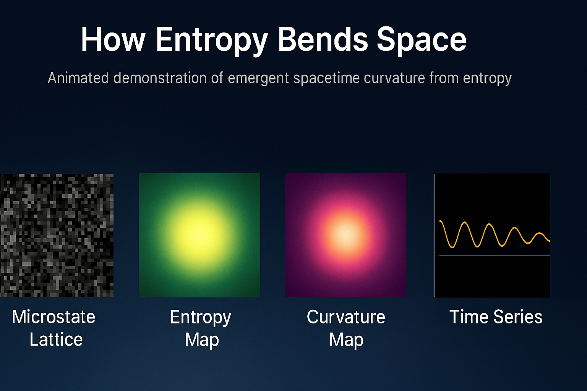

# HES-benchmark
Simulation of emergent spacetime curvature from entanglement entropy using the HES framework

Audio from NotebookLM deepdive

[Listen to audio](Audio/HES_Audio001.m4a)

## 🧬 Abstract

This benchmark simulation demonstrates how spacetime curvature can emerge from entanglement entropy in a discrete lattice system. Built on the Holographic Entropic Spacetime (HES) framework, the model evolves a 2D and 3D grids of microstates under local entropic interactions and global feedback dynamics. 

Key features include:
- Entropy gradients generating curvature via Laplacian analysis
- Global damping suppressing vacuum energy and stabilizing the lattice
- Visual outputs of microstate evolution, entropy maps, and curvature fields
- Time-series tracking of entropy and global energy oscillations

The simulation is designed for reproducibility, exploration, and outreach. It offers a hands-on demonstration of how entropic structure alone can give rise to geometric behavior—bridging ideas from quantum information, statistical mechanics, and emergent gravity.

Run the notebook in Google Colab, tweak parameters, and visualize the birth of spacetime from entropy.

## 🌀 Visual Explainer: How Entropy Bends Space

This animation illustrates how spacetime curvature emerges from entanglement entropy in the HES framework:

1. **Microstate Lattice**: Random quantum states evolve toward equilibrium.
2. **Entropy Map**: Entanglement structure forms smooth gradients.
3. **Curvature Map**: Geometry bends in response to entropy.
4. **Time Series**: Entropy stabilizes while global energy oscillates.

> “Spacetime is not built from particles—it’s woven from entanglement.”

📊 [Simulation Details](SIMULATION)

# Holographic Entropic Spacetime (HES) Benchmark

This repository contains a reproducible simulation demonstrating how spacetime curvature emerges from entanglement entropy among discrete microstates. It implements the HES framework—a toy model where entropy gradients generate curvature, and global feedback suppresses vacuum energy.

## 🔬 Features

2D Grid

- 2D lattice evolution under HES dynamics
- Entropy and curvature visualization
- Global feedback and damping terms
- Time-series tracking of entropy and global stability
- Ready-to-run in Google Colab

## 🚀 Launch in Colab

Click below to open and run the notebook instantly in Google Colab:

3D grids

Static Curvature Hotspots

Gradient Evolution

Directional Curvature

Curvature Memory

Scalar Field

Overlay: Scalar Field + Curvature Memory

## 📁 Files

- `HES_Benchmark.ipynb`: Main simulation notebook
- `README.md`: Project overview and instructions
- `HES_3D.ipynb`: Main simulation notebook
- `Copy_of_HES_3D_Anime.ipynb`: Main simulation notebook
- `HES_HES_3DAne2`: Main simulation notebook
- `HES_Copy_of_HSE_3DAnime3.ipynb`: Main simulation notebook
- `HES_Hes_3DAnime4.ipynb`: Main simulation notebook
- `HES_HES_3DAnime5.ipynb`: Main simulation notebook

## 📖 How to Use

1. Open the notebook in Colab using the badge above.
2. Run each cell sequentially.
3. View the final lattice, entropy map, curvature map, and time-series plots.
4. Modify parameters (α, β, γ, δ) to explore different regimes.

## 📜 License

MIT License (or choose another if preferred)

## 👤 Author

Chris — [GitHub Profile](https://github.com/YOUR_USERNAME)
