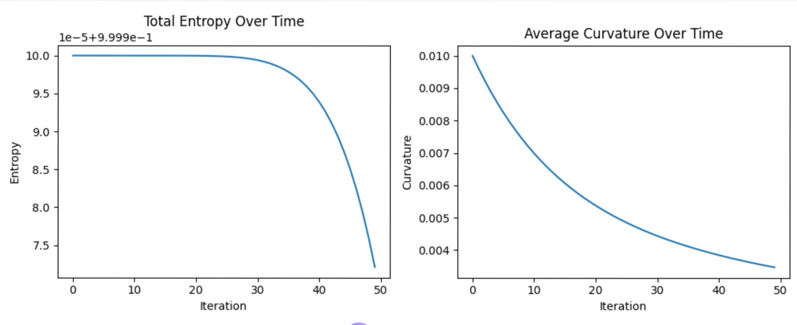
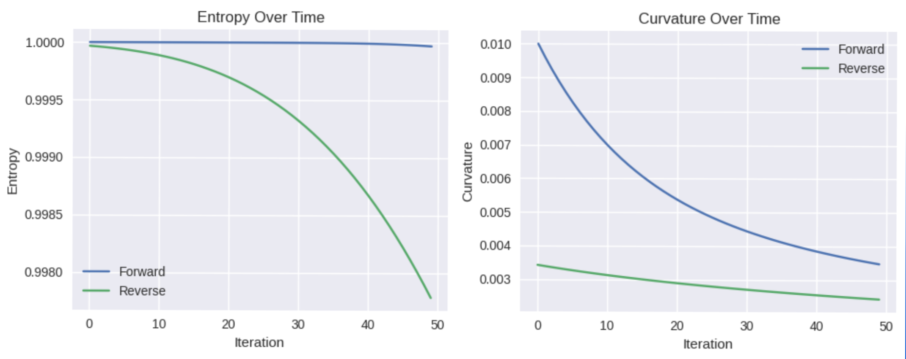
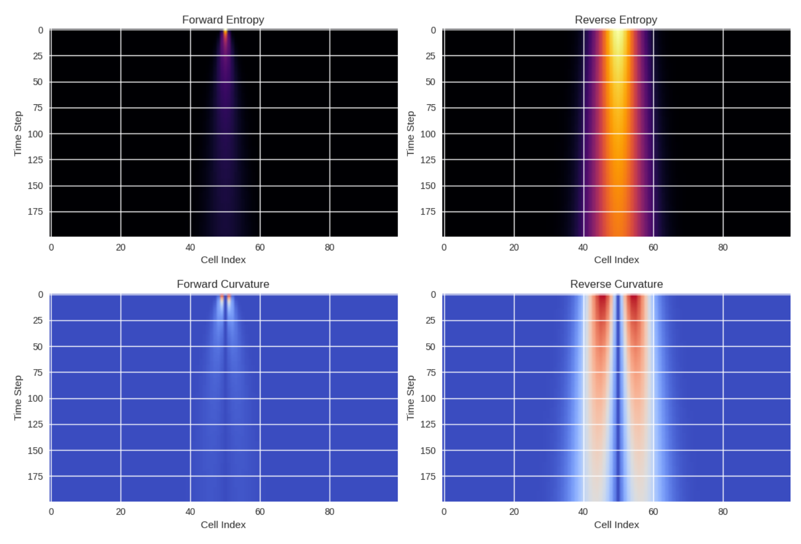

Phase 1: Forward Evolution — Global Metrics

We begin not with reversibility, but with emergence.

From a single spike of entropy at the center of the lattice, the system unfolds. Entropy diffuses outward, and curvature—born from gradients and memory—rises briefly, then fades.

These two plots trace the global heartbeat of the simulation:

• Total Entropy Over Time
Entropy climbs as the system spreads, then plateaus. The spike forgets itself. Diffusion wins.
• Average Curvature Over Time
Curvature flares early—sharp gradients from the spike—then smooths into silence. Geometry dissolves.

🧠 Interpretation:
This phase confirms the simulation’s forward behavior. Entropy increases, curvature decays. Time flows, structure fades. The system forgets its origin—and prepares to be tested.

Phase 2: Reversibility Test — Global Comparison

We now ask the system to retrace its steps.

Starting from the final state of the forward simulation, we reverse the update rules. Entropy should reconcentrate. Curvature should re-emerge. But they don’t.

These plots compare the forward and reverse trajectories:

• Entropy Over Time
The forward curve rises and stabilizes. The reverse curve declines—but not toward the original spike. The system forgets.
• Curvature Over Time
Geometry emerges in the forward run, then fades. In reverse, it barely stirs. The gradients are gone. The structure doesn’t return.

🧠 Interpretation:
Reversibility fails—not because of numerical error, but because of memory loss. The system evolves forward with accumulating memory, but reversing that memory doesn’t restore the past. Time’s arrow is visible in the metrics.

Phase 3: Reversibility — Spatial Diagnostics

We now ask the system not just to rewind its metrics, but to reconstruct its structure.

These four heatmaps show how entropy and curvature evolve across space and time—first forward, then in attempted reverse:

• Forward Entropy
A tight spike diffuses outward. The system forgets its origin.
• Reverse Entropy
A broader, chaotic band. No reconcentration. The past is unrecoverable.
• Forward Curvature
Gradients emerge, then fade. Geometry responds to entropy’s flow.
• Reverse Curvature
Distorted bands, no restoration. The system tries to rewind—but leaves scars.

🧠 Interpretation:
Time’s arrow is visible in the structure itself. The reverse simulation doesn’t reconstruct the forward one—it mutates it. Memory loss breaks reversibility. Geometry remembers what entropy forgets.
